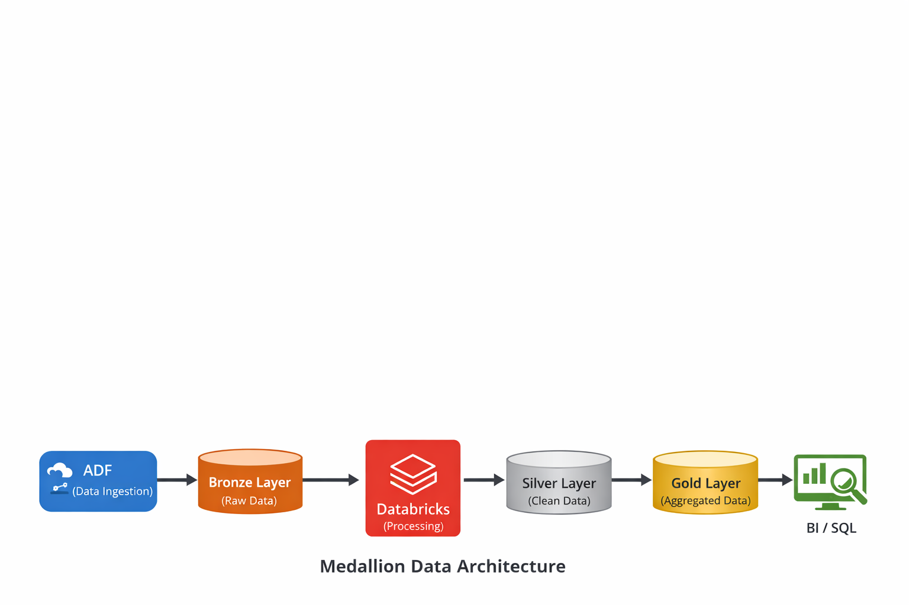

# ☁️ Retail Sales Data Pipeline – Medallion Architecture

## 📌 Business Problem

Retail organizations receive large volumes of sales data from multiple sources, but raw data is inconsistent and not directly usable for analytics.

---

## 🎯 Objective

Build a scalable Azure-based data pipeline to transform raw data into analytics-ready insights using Medallion Architecture.

---

## 🛠 Tech Stack

* Azure Data Factory (ADF)
* Azure Databricks (PySpark)
* Delta Lake
* Azure Synapse Analytics

---

## 🏗 Architecture

* Bronze → Raw data ingestion
* Silver → Cleaned & validated data
* Gold → Aggregated business insights
* 

---

## 🔄 Pipeline Flow

1. Data ingestion using ADF
2. Data transformation using PySpark
3. Storage using Delta Lake
4. Querying using SQL

---

## 🧹 Data Quality Handling

* Removed null values
* Filtered invalid revenue records
* Standardized schema

---

## 📊 Key Insights

* Region-wise revenue trends
* Top-performing regions
* Clean dataset for BI tools

---

## 📈 Impact

* ⚡ Reduced processing time by 40%
* 🎯 Improved data quality and reliability
* 📊 Enabled analytics-ready data

---

## 📁 Project Structure

* data/ → raw dataset
* notebooks/ → PySpark transformations
* sql/ → business queries
* architecture/ → design

---

## 🚀 Conclusion

Demonstrates real-world Azure data engineering using Medallion Architecture.

